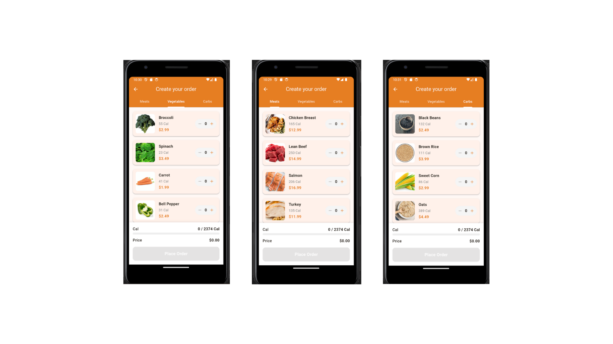
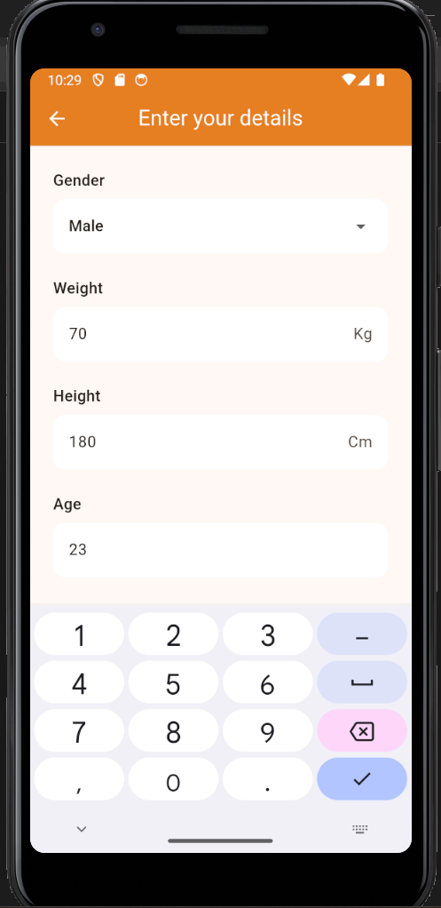
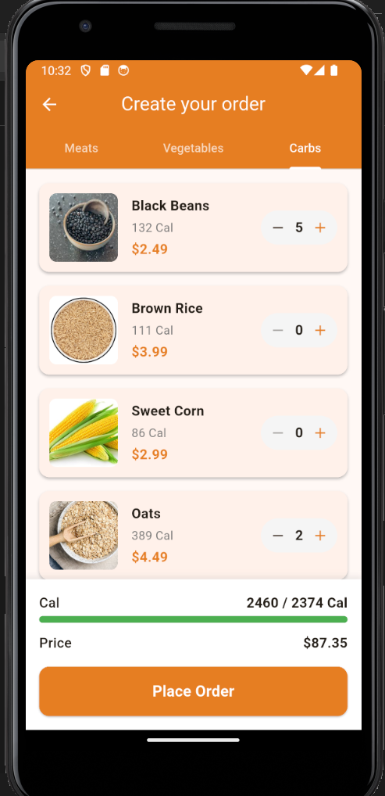
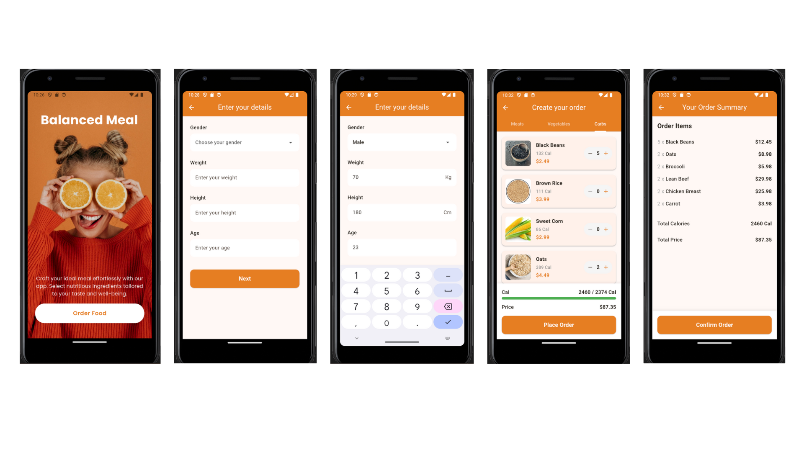

# Balanced Meal App

A Flutter-based mobile application that helps users create nutritionally balanced meals by selecting from a variety of ingredients across different food categories for SprintUp - Mobile Development By Flutter Course [Course Link](https://sprints.ai/en-eg/journeys/SprintUpMobileDevelopmentByFlutter) Project (Flutter Shopping App Project).

## 🍽️ Features

- **User-Friendly Interface**: Clean and intuitive design for easy navigation
- **Ingredient Selection**: Browse and select from a variety of:
  - 🥩 Meats (Chicken, Beef, etc.)
  - 🥦 Vegetables (Broccoli, Carrots, etc.)
  - 🍚 Carbs (Rice, Pasta, etc.)
    
- **Nutritional Tracking**: Real-time calorie calculation
- **Order Management**: Add/remove ingredients and adjust quantities
- **Responsive Design**: Works on different screen sizes

## 🚀 Setup Instructions

### Prerequisites

- Flutter SDK (latest stable version)
- Dart SDK (comes with Flutter)
- Android Studio / Xcode (for emulators)
- Firebase project (for backend)

### Installation

1. **Clone the repository**
   ```bash
   git clone [your-repository-url]
   cd balanced_meal
   ```

2. **Install dependencies**
   ```bash
   flutter pub get
   ```

3. **Set up Firebase**
   - Create a new Firebase project
   - Add an Android/iOS app to your Firebase project
   - Download the configuration files:
     - Android: `google-services.json`
     - iOS: `GoogleService-Info.plist`
   - Place the files in the appropriate directories

4. **Run the app**
   ```bash
   flutter run
   ```

## 🛠️ Project Structure

```
lib/
├── main.dart              # App entry point
├── models/               # Data models
│   └── ingredient.dart   # Ingredient model
├── screens/              # App screens
│   ├── home_screen.dart
│   ├── create_order_screen.dart
│   ├── order_summary_screen.dart
│   └── user_info_screen.dart
├── services/             # Business logic
│   └── firebase_service.dart
└── widgets/              # Reusable widgets
    └── ingredient_card.dart
```

## 📱 Screens

Figma link: [Design](https://www.figma.com/proto/PlffAnOjE7vVvrvc7yC8HC/Balanced-Meal?node-id=0-1&t=2sH3WVa7motQX5QB-1)

| Description | Screenshot |
|-------------|------------|
| **Home Screen**<br>- Welcome message<br>- Start ordering button |  |
| **User Info**<br>- Collect user details<br>- Dietary preferences |  |
| **Create Order**<br>- Tabbed interface for different ingredient categories <br> - Add/remove items <br>- Real-time calorie and price calculation |  |
| **Order Summary**<br> - Review selected itemss<br>- Total calories and price<br>- Confirm order button |  |

## 📱 Main Scenario



## 📊 Calorie Calculation

The app calculates the user's daily caloric needs using the following formulas based on the Harris-Benedict equation:

### For Women
```
calories = 655.1 + (9.56 × weight in kg) + (1.85 × height in cm) - (4.67 × age in years)
```

### For Men
```
calories = 66.47 + (13.75 × weight in kg) + (5 × height in cm) - (6.75 × age in years)
```

### Example Calculation
For a 40-year-old male who is 190cm tall and weighs 90kg:
```
= 66.47 + (13.75 × 90) + (5 × 190) - (6.75 × 40)
= 66.47 + 1,237.5 + 950 - 270
= 1,983.97 calories/day
```

## 🔌 API Integration

### Order Placement

The app makes a POST request to the following endpoint when confirming an order:

```
https://uz8if7.buildship.run/placeOrder
```

#### Request Payload

```json
{
  "items": [
    {
      "name": "Salmon",
      "total_price": 12,
      "quantity": 1
    },
    {
      "name": "Beef",
      "total_price": 24,
      "quantity": 2
    }
  ]
}
```

#### Response

- `true`: If the order was successfully placed (valid structure)
- `false`: If there was an issue with the request

## 🔧 Dependencies

- `firebase_core`: Firebase Core
- `cloud_firestore`: Cloud Firestore database
- `http`: For making API requests
- `provider`: State management
- `cached_network_image`: Image loading and caching
- `google_fonts`: Custom fonts

## 🤝 Contributing

1. Fork the repository
2. Create your feature branch (`git checkout -b feature/AmazingFeature`)
3. Commit your changes (`git commit -m 'Add some AmazingFeature'`)
4. Push to the branch (`git push origin feature/AmazingFeature`)
5. Open a Pull Request
